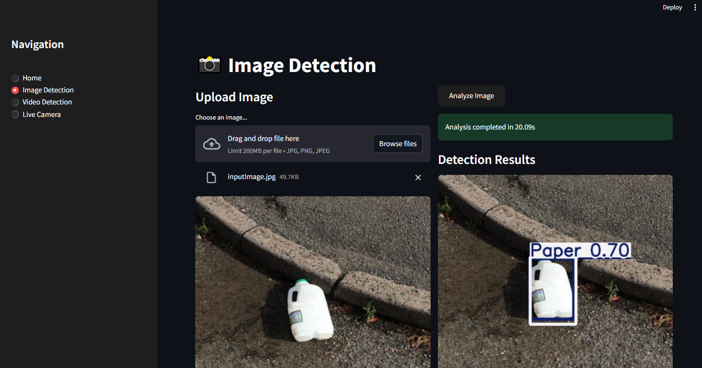

# Automated Waste Detection with YOLOv5 🚮🔍


An end-to-end solution for automated waste detection using YOLOv5, featuring model training pipelines, FastAPI inference, Streamlit interface, and AWS CI/CD deployment.

## Key Features ✨
- Automated training pipeline (data ingestion → validation → training)
- Dual interface options (Web UI + REST API)
- Real-time detection from camera feed
- Model optimization (ONNX/TensorRT export)
- AWS CI/CD pipeline with self-hosted runners
- GPU-accelerated inference support

## Installation & Setup ⚙️

### Prerequisites
- Conda package manager
- Python 3.8+
- NVIDIA GPU (recommended)

```bash
# Clone repository
git clone https://github.com/hafizshakeel/Automated-Waste-Detection-YOLOv5-AWS-CICD.git
cd Automated-Waste-Detection-YOLOv5-AWS-CICD

# Create Conda environment
conda env create -f applications.yaml
conda activate waste-detection

# Install dependencies
pip install -r requirements.txt
```

## Usage 🚀

### Model Training
```bash
python app_train.py
```
**Note:** For Google Colab users, use `notes/train_model_gc.ipynb`

### Inference Options
**Web Interface:**
```bash
streamlit run app_ui.py
```

**REST API:**
```bash
python app_api.py
# API Docs: http://localhost:8000/docs
```

### Advanced Detection Commands
| Task                      | Command                                                                 |
|---------------------------|-------------------------------------------------------------------------|
| Image Detection           | `python yolov5/detect.py --weights weights/best_100.pt --img 416 --conf 0.5 --source input.jpg` |
| Real-Time Camera          | `python yolov5/detect.py --weights weights/best_100.pt --img 320 --conf 0.25 --source 0` |
| Optimized Inference (FP16) | `python yolov5/detect.py --weights weights/best_100.pt --half --source 0` |
| ONNX Export               | `python yolov5/export.py --weights weights/best_100.pt --include onnx` |
| TensorRT Conversion       | `trtexec --onnx=best_100.onnx --saveEngine=best_100.trt` |

## Detection Results 🎯

### Image Detection Preview

*Streamlit interface showing paper waste detection with 70% confidence*

<!--### Video Detection Demo
[](data/Plastic_Waste_Detection.mp4)
*(Click the image to watch video demonstration)* -->

## AWS CI/CD Pipeline ☁️

### Infrastructure Setup
1. **IAM Configuration**:
   - Create user with `AmazonEC2ContainerRegistryFullAccess` and `AmazonEC2FullAccess`
   - Store credentials in GitHub Secrets:
     ```
     AWS_ACCESS_KEY_ID
     AWS_SECRET_ACCESS_KEY
     AWS_REGION (us-east-1)
     AWS_ECR_LOGIN_URI (your-account-id.dkr.ecr.us-east-1.amazonaws.com)
     ECR_REPOSITORY_NAME (waste_detection)
     ```

2. **ECR Setup**:
   ```bash
   # Create ECR repository
   aws ecr create-repository --repository-name waste_detection --region us-east-1
   
   # Get repository URI (save this)
   aws ecr describe-repositories --repository-names waste_detection --query 'repositories[0].repositoryUri'
   ```
   

3. **EC2 Instance**:
   - Ubuntu t2.xlarge (32GB+ storage)
   - Install Docker:
     ```bash
     sudo apt-get update && sudo apt-get upgrade -y
     curl -fsSL https://get.docker.com -o get-docker.sh
     sudo sh get-docker.sh
     sudo usermod -aG docker ubuntu
     newgrp docker
     ```

4. **Self-Hosted Runner**:
   ```bash
   # Configure from GitHub Settings > Actions > Runners
   ./config.sh --url https://github.com/your-repo --token YOUR_TOKEN
   ./run.sh
   ```

## Deployment Notes 📦
```bash
# Run containerized application
docker run -d -p 8501:8501 --name waste-detection-$(date +%s) your-ecr-image

# Access via:
http://<EC2-Public-IP>:8501
```

**Important:** Terminate EC2 instances and clean up ECR repositories when not in use to avoid charges.

## Troubleshooting 🛠️
- **Runner Connectivity**: Ensure runner process is active with `./run.sh` in `actions-runner` directory
- **Port Configuration**: Add inbound rule for port 8501 in EC2 security group
- **Docker Permissions**: Always run `newgrp docker` after instance reboot

## License 📄
MIT License - See [LICENSE](LICENSE) for details

## Acknowledgments 
- https://github.com/ultralytics
- https://github.com/entbappy
- AWS, Streamlit & FastAPI communities

